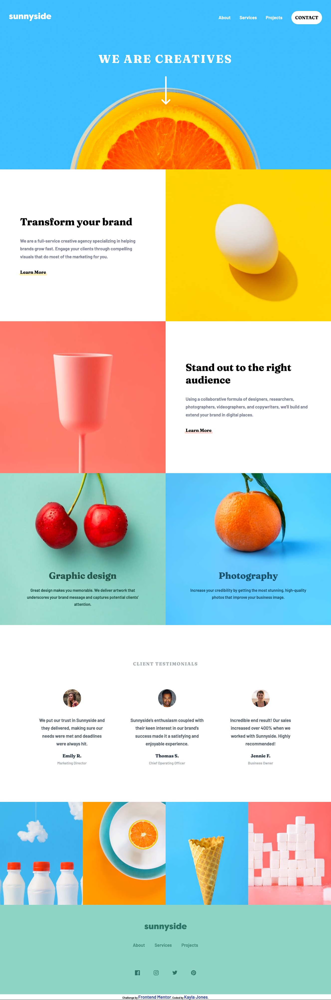
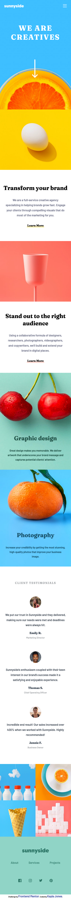

# Frontend Mentor - Sunnyside agency landing page solution

This is a solution to the [Sunnyside agency landing page challenge on Frontend Mentor](https://www.frontendmentor.io/challenges/sunnyside-agency-landing-page-7yVs3B6ef). Frontend Mentor challenges help you improve your coding skills by building realistic projects.

## Table of contents

- [The challenge](#the-challenge)
- [Screenshot](#screenshot)
- [Links](#links)
- [My process](#my-process)
  - [Built with](#built-with)
  - [What I learned](#what-i-learned)
  - [Continued development](#continued-development)
- [Author](#author)
- [Acknowledgments](#acknowledgments)

### The challenge

Users should be able to:

- View the optimal layout for the site depending on their device's screen size
- See hover states for all interactive elements on the page

### Screenshot

;
;

### Links

- Solution URL: [Add solution URL here](https://github.com/joneskb1/sunnyside-frontend-mentor)
- Live Site URL: [Add live site URL here](https://heuristic-archimedes-60ba80.netlify.app/)

## My process

- I'm a newbie leaning HTML/CS/JS online. I haven't build anything with html & css in 8 months, so this was a good starter challenge for me to get back into HTML/CSS.

### Built with

- Semantic HTML5 markup
- Flexbox
- CSS Grid
- Mobile-first workflow

### What I learned

-I learned that you don't jump from mobile to desktop without having a media query inbetween!

// on hover, change imgs for social logos
social.forEach((el) => {
el.addEventListener("mouseover", function (e) {
const platform = e.target.src.slice(34).replace(".svg", "");
e.target.src = `images/icon-${platform}-active.svg`;
});

el.addEventListener("mouseout", function (e) {
const platform = e.target.src.slice(34).replace("-active.svg", "");
e.target.src = `images/icon-${platform}.svg`;
});
});

### Continued development

-Custom properties in CSS
-APIs with JS
-Accessibility HTML
-Frontend frameworks

## Author

- Website - [Kayla Jones](https://github.com/joneskb1)
- Frontend Mentor - [@joneskb1](https://www.frontendmentor.io/profile/joneskb1)

## Acknowledgments

Thanks Frontend Mentor for the challenge! :D
